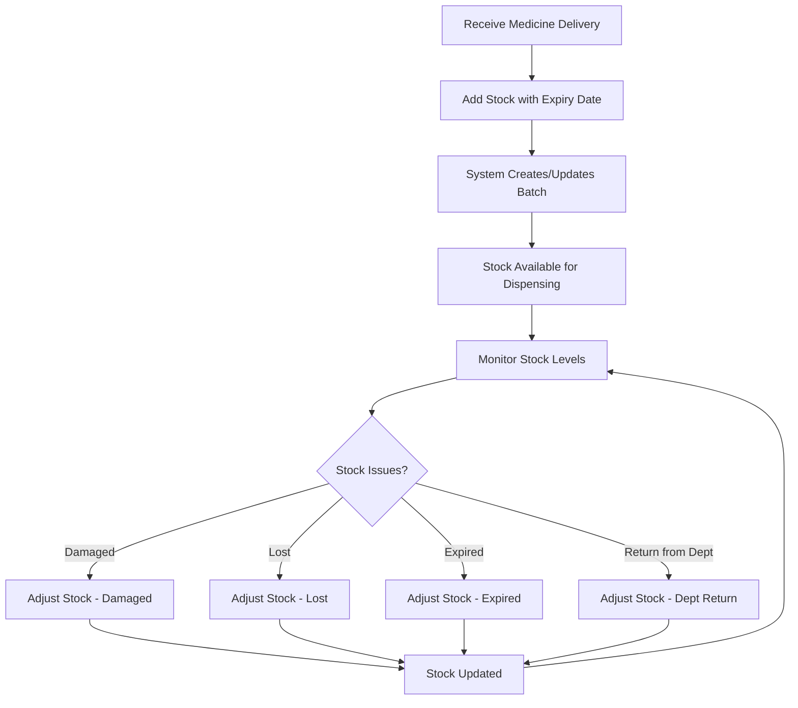
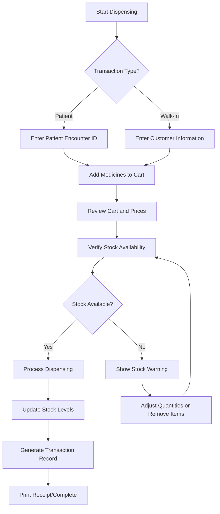
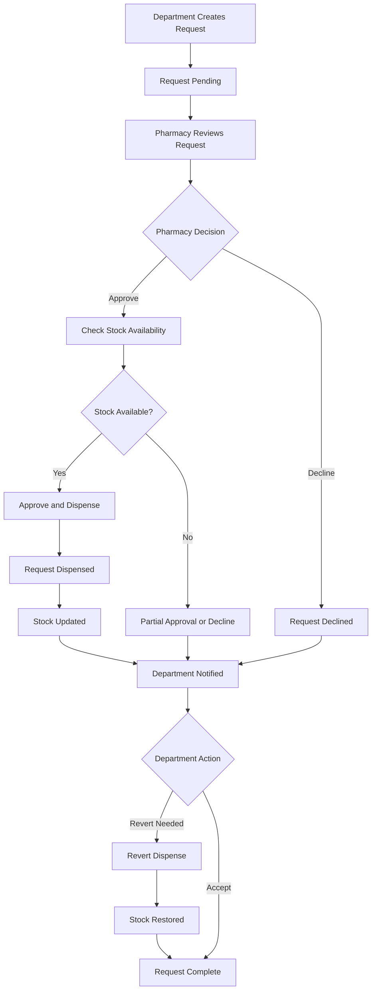

# Hospital Pharmacy Management System - User Manual

## Table of Contents
1. [System Overview](#system-overview)
2. [Getting Started](#getting-started)
3. [Managing Medicines](#managing-medicines)
4. [Managing Stocks](#managing-stocks)
5. [Dispensing Medicines](#dispensing-medicines)
6. [Managing Dispense Transactions](#managing-dispense-transactions)
7. [Handling Pharmacy Requests](#handling-pharmacy-requests)
8. [Pharmacy Reports](#pharmacy-reports)
9. [Troubleshooting](#troubleshooting)
10. [Best Practices](#best-practices)

---

## System Overview

The Hospital Pharmacy Management System is a comprehensive digital solution designed to streamline pharmacy operations, ensuring accurate inventory management, safe dispensing practices, and complete financial tracking.

### Key Features
- **Medicine Management**: Complete catalog of medicines with pricing
- **Stock Management**: Real-time inventory tracking with batch management
- **Dispensing System**: Safe dispensing for patients and walk-in customers
- **Transaction Management**: Complete transaction history with pricing details
- **Requisition System**: Departmental medicine requests and approvals
- **Reports & Analytics**: Comprehensive reporting for decision-making

### User Roles
- **Pharmacist**: Full access to all pharmacy functions
- **Department Staff**: Can create and manage requisitions
- **Administrator**: System configuration and user management

---

## Getting Started

### Login Process
1. Navigate to the hospital system login page
2. Enter your username and password
3. Click "Login" button
4. Upon successful authentication, you'll be redirected to the dashboard

*[Screenshot: Login page]*

### Dashboard Overview
The dashboard provides a quick overview of pharmacy operations:
- **Total Medicines**: Current medicine catalog size
- **Low Stock Items**: Medicines requiring attention
- **Expiring Soon**: Medicines approaching expiration
- **Out of Stock**: Medicines needing restocking

*[Screenshot: Dashboard overview]*

### Navigation
Access pharmacy features through the main navigation menu:
- **Dashboard**: System overview and quick stats
- **Medicine Management**: Create and manage medicines
- **Stock Management**: Handle inventory and adjustments
- **Dispensing**: Process patient and walk-in transactions
- **Transactions**: View and manage dispense history
- **Requests**: Handle departmental requisitions
- **Reports**: Generate comprehensive reports

*[Screenshot: Navigation menu]*

---

## Managing Medicines

### Overview
Medicine management is the foundation of the pharmacy system. Each medicine is defined by its brand name, generic name, dosage form, and current price.

### Medicine Information Structure
- **Brand Name**: Commercial name of the medicine
- **Generic Name**: Scientific/generic name
- **Dosage Form**: Tablet, Capsule, Syrup, Injection, etc.
- **Price**: Current unit price in PHP (₱)

### Adding New Medicine

#### Step-by-Step Process
1. Navigate to **Medicine Management** from the main menu
2. Click the **"Add New Medicine"** button
3. Fill in the required information:
   - **Brand Name**: Enter the commercial name
   - **Generic Name**: Enter the scientific name
   - **Dosage Form**: Select or enter the form (e.g., Tablet, Capsule)
   - **Price**: Enter the current unit price
4. Click **"Save"** to create the medicine

*[Screenshot: Add medicine form]*

#### Validation Rules
- All fields are required
- Brand Name + Generic Name + Dosage Form must be unique
- Price must be a positive number
- Special characters are allowed in names

#### Success Confirmation
After successful creation, you'll see:
- Success message confirmation
- Medicine appears in the medicines list
- New medicine available for stock management

### Editing Medicine Information

#### When to Edit
- Price changes from suppliers
- Correction of medicine details
- Updating dosage form information

#### Edit Process
1. Navigate to **Medicine Management**
2. Locate the medicine to edit
3. Click the **"Edit"** button for that medicine
4. Modify the necessary fields
5. Click **"Save"** to update

*[Screenshot: Edit medicine form]*

#### Important Notes
- **Price Changes**: New prices only affect future transactions
- **Historical Data**: Past transactions maintain original prices
- **Stock Impact**: Editing doesn't affect existing stock levels

### Medicine Search and Filtering

#### Search Functionality
1. Use the search box at the top of the medicines list
2. Enter any part of:
   - Brand name
   - Generic name
   - Dosage form
3. Results filter automatically as you type

*[Screenshot: Medicine search]*

#### Stock Level Filters
- **All**: Show all medicines
- **In Stock**: Medicines with available quantity
- **Low Stock**: Medicines below threshold
- **Out of Stock**: Medicines with zero quantity

### Deleting Medicines

#### Deletion Rules
- Medicine can only be deleted if it has:
  - No stock batches
  - No transaction history
  - No pending requisitions

#### Deletion Process
1. Navigate to **Medicine Management**
2. Click **"Delete"** for the medicine
3. Confirm deletion in the popup
4. Medicine is permanently removed

*[Screenshot: Delete confirmation]*

---

## Managing Stocks

### Overview
Stock management handles all inventory operations including new deliveries, stock adjustments, and batch tracking. The system uses a medicine-level interface that automatically handles batch complexity.

### Stock Management Workflow

### Adding Stock (New Deliveries)

#### When to Add Stock
- New medicine deliveries arrive
- Purchase orders fulfilled
- Returns from departments
- Inventory corrections (increases)

#### Add Stock Process
1. Navigate to **Stock Management**
2. Click **"Stock Adjustment"** button
3. Select **Medicine** from dropdown
4. Choose **"Add Stock"** as adjustment type
5. Enter **Quantity** to add
6. Enter **Expiry Date** (required)
7. Add **Notes** (optional but recommended)
8. Click **"Save"**

*[Screenshot: Add stock form]*

#### Batch Logic
- **Existing Batch**: If batch with same expiry date exists, quantity is added
- **New Batch**: If no matching expiry date, new batch is created
- **FEFO Principle**: First Expired, First Out for dispensing

### Stock Adjustments

#### Adjustment Types

##### 1. Damaged Stock
**When to Use**: Medicine damaged during transport or storage
**Process**:
1. Select medicine and "Damaged" adjustment type
2. Enter quantity to remove
3. Enter expiry date of damaged batch
4. Add detailed notes about damage
5. Save adjustment

*[Screenshot: Damaged stock adjustment]*

##### 2. Lost Stock
**When to Use**: Medicine lost or stolen
**Process**:
1. Select medicine and "Lost" adjustment type
2. Enter quantity to remove
3. Enter expiry date of lost batch
4. Add notes about circumstances
5. Save adjustment

##### 3. Expired Stock
**When to Use**: Medicine reached expiry date
**Process**:
1. Select medicine and "Expired" adjustment type
2. Enter quantity to remove
3. Enter expiry date of expired batch
4. Add notes about disposal
5. Save adjustment

*[Screenshot: Expired stock adjustment]*

##### 4. Department Return
**When to Use**: Department returns unused medicine
**Process**:
1. Select medicine and "Department Return" adjustment type
2. Enter quantity to add back
3. Enter expiry date
4. Add notes about return reason
5. Save adjustment

### Stock Preview System

#### Real-Time Stock Calculation
The system shows:
- **Current Stock**: Present quantity before adjustment
- **Adjustment**: Quantity being added or removed
- **New Stock**: Calculated quantity after adjustment

*[Screenshot: Stock preview]*

#### Validation Checks
- **Insufficient Stock**: Cannot reduce more than available
- **Expiry Date Match**: Must match existing batch for reductions
- **Positive Quantities**: All quantities must be positive numbers

### Viewing Stock Levels

#### Stock Information Display
For each medicine, you can view:
- **Current Stock**: Total available quantity
- **Batches**: Individual batch details
- **Expiry Dates**: When batches expire
- **Last Updated**: Recent stock changes

*[Screenshot: Stock levels view]*

#### Stock Status Indicators
- **Green**: Good stock levels
- **Yellow**: Low stock warning
- **Red**: Out of stock or critically low

---

## Dispensing Medicines

### Overview
The dispensing system handles medicine distribution to patients and walk-in customers with comprehensive pricing and inventory management.

### Dispensing Workflow

### Patient Dispensing

#### Prerequisites
- Patient must have valid encounter ID
- Medicines must be in stock
- User must have dispensing permissions

#### Step-by-Step Process
1. Navigate to **Dispensing** page
2. Select **"Patient"** transaction type
3. Enter **Patient Encounter ID**
4. Patient information auto-loads if valid

*[Screenshot: Patient dispensing setup]*

#### Adding Medicines to Cart
1. Use the medicine search to find required medicines
2. Select medicine from search results
3. Enter **Quantity** needed
4. Click **"Add to Cart"**
5. Medicine appears in cart with pricing

*[Screenshot: Adding medicines to cart]*

#### Cart Management
- **View Items**: See all added medicines
- **Modify Quantities**: Change quantities as needed
- **Remove Items**: Delete items from cart
- **Price Calculation**: Real-time total calculation

*[Screenshot: Cart management]*

### Walk-in Customer Dispensing

#### Customer Information Required
- **Customer Name**: Full name of customer
- **Birthday**: Date of birth for records
- **Account Number**: Auto-generated after first transaction

#### Step-by-Step Process
1. Navigate to **Dispensing** page
2. Select **"Walk-in"** transaction type
3. Enter **Customer Name**
4. Enter **Customer Birthday**
5. Add medicines to cart (same as patient process)
6. Review and process transaction

*[Screenshot: Walk-in customer form]*

#### Account Number Generation
- Format: WI########
- Generated automatically after first transaction
- Used for future reference and tracking

### Cart and Pricing System

#### Price Display
- **Unit Price**: Individual medicine price
- **Quantity**: Number of units being dispensed
- **Total Price**: Unit price × Quantity
- **Cart Total**: Sum of all item totals

*[Screenshot: Cart pricing display]*

#### Currency Formatting
- All prices displayed in Philippine Peso (₱)
- Two decimal places for accuracy
- Professional formatting throughout

#### Real-Time Calculations
- Cart totals update automatically
- Price changes reflect immediately
- Stock availability checked in real-time

### Stock Warnings and Validations

#### Stock Status Indicators
- **Green**: Adequate stock available
- **Yellow**: Low stock warning
- **Red**: Out of stock or insufficient

*[Screenshot: Stock warnings]*

#### Validation Messages
- **Insufficient Stock**: "Not enough stock available"
- **Out of Stock**: "Medicine is out of stock"
- **Invalid Quantity**: "Please enter a valid quantity"

### Completing Dispensing Transaction

#### Final Review
1. Review all cart items
2. Verify customer/patient information
3. Check total amount
4. Add notes if necessary

#### Processing Transaction
1. Click **"Dispense"** button
2. System validates stock availability
3. Transaction is processed
4. Stock levels updated automatically
5. Transaction record created

*[Screenshot: Transaction completion]*

#### Success Confirmation
- Transaction ID generated
- Receipt information displayed
- Stock levels updated
- Transaction history updated

---

## Managing Dispense Transactions

### Overview
Transaction management provides comprehensive tracking of all dispensing activities with detailed pricing, customer information, and stock impacts.

### Transaction History Overview

#### Accessing Transaction History
1. Navigate to **Transactions** from main menu
2. Select transaction type tab:
   - **Patient Transactions**: Hospital patient dispensing
   - **Walk-in Transactions**: Customer dispensing

*[Screenshot: Transaction history tabs]*

#### Transaction List Display
Each transaction shows:
- **Date & Time**: When dispensing occurred
- **Transaction Type**: Patient or Walk-in
- **Customer/Patient**: Name and ID information
- **Total Amount**: Complete transaction cost
- **Status**: Success or Reverted

*[Screenshot: Transaction list]*

### Viewing Transaction Details

#### Accessing Details
1. From transaction list, click **"View Details"**
2. Complete transaction information displays
3. All medicine details and pricing shown

*[Screenshot: Transaction details button]*

#### Transaction Information Display

##### Header Information
- **Transaction Date**: When dispensing occurred
- **Transaction Type**: Patient or Walk-in indicator
- **Status**: Success or Reverted with visual indicators

##### Customer Information (Walk-in)
- **Customer Name**: Full name as entered
- **Account Number**: Generated account number
- **Birthday**: Date of birth for records

*[Screenshot: Walk-in customer information]*

##### Patient Information
- **Patient Name**: From hospital records
- **Hospital ID**: Patient identification number
- **Encounter ID**: Specific visit reference

##### Medicine Details
For each dispensed medicine:
- **Brand Name**: Commercial name
- **Generic Name**: Scientific name
- **Dosage Form**: Tablet, Capsule, etc.
- **Quantity**: Number of units dispensed
- **Unit Price**: Price per unit at time of dispensing
- **Total Price**: Unit price × Quantity

*[Screenshot: Medicine details in transaction]*

##### Transaction Summary
- **Total Items**: Number of different medicines
- **Total Quantity**: Combined quantity of all medicines
- **Transaction Total**: Complete cost in PHP (₱)

*[Screenshot: Transaction summary]*

### Transaction Pricing System

#### Price Immutability
- **Historical Accuracy**: Prices preserved from dispensing time
- **Price Changes**: Current price changes don't affect past transactions
- **Audit Trail**: Complete financial record maintained

#### Price Display Format
- **Currency**: Philippine Peso (₱) throughout
- **Decimal Places**: Two decimal places for accuracy
- **Alignment**: Right-aligned for professional appearance

### Transaction Status Management

#### Status Types
- **Success**: Transaction completed normally
- **Reverted**: Transaction has been reversed

#### Status Indicators
- **Success Badge**: Green background with checkmark icon
- **Reverted Badge**: Red background with undo icon

*[Screenshot: Status indicators]*

### Transaction Reversal (Revert)

#### When to Revert
- Dispensing error occurred
- Medicine returned by patient/customer
- Correction needed for inventory

#### Revert Process
1. Open transaction details
2. Click **"Revert Transaction"** button
3. Password verification modal appears
4. Enter your password
5. Confirm reversal action

*[Screenshot: Revert transaction process]*

#### Password Verification
- **Security Measure**: Prevents unauthorized reversals
- **User Authentication**: Confirms identity
- **Audit Trail**: Records who performed reversal

*[Screenshot: Password verification modal]*

#### Revert Impact
- **Stock Restoration**: Medicines returned to inventory
- **Status Update**: Transaction marked as reverted
- **Audit Log**: Reversal logged with timestamp and user

#### Revert Restrictions
- **Already Reverted**: Cannot revert again
- **UI Indication**: Revert button disabled for reverted transactions

### Transaction Search and Filtering

#### Search Functionality
- **Date Range**: Filter by transaction dates
- **Customer Name**: Search by customer/patient name
- **Transaction Type**: Filter by Patient or Walk-in

#### Sorting Options
- **Date**: Newest to oldest (default)
- **Amount**: Highest to lowest
- **Customer**: Alphabetical order

*[Screenshot: Transaction search and filters]*

---

## Handling Pharmacy Requests

### Overview
The pharmacy request system enables hospital departments to formally request medicines from the pharmacy with a complete approval and dispensing workflow.

### Request Management Workflow

### Department Request Creation

#### Accessing Request System
1. Navigate to **Requests** from main menu
2. Department users see their department's requests
3. Click **"Create New Request"** button

*[Screenshot: Request creation button]*

#### Request Form
1. **Requesting Department**: Auto-filled from user profile
2. **Medicine Selection**: Choose medicines from dropdown
3. **Quantities**: Enter required quantities
4. **Notes**: Optional notes for pharmacy staff
5. **Submit**: Send request to pharmacy

*[Screenshot: Request creation form]*

#### Request Validation
- **Positive Quantities**: All quantities must be greater than zero
- **Medicine Selection**: Must select at least one medicine
- **Department Authorization**: User must belong to requesting department

### Pharmacy Request Management

#### Pharmacy Worklist
Pharmacists can view all incoming requests:
1. Navigate to **Pharmacy Requests**
2. View all pending requests from departments
3. Requests sorted by date (newest first)
4. Status indicators for each request

*[Screenshot: Pharmacy worklist]*

#### Request Details View
Click on any request to view:
- **Department Information**: Requesting department and user
- **Request Date**: When request was created
- **Medicine List**: All requested medicines and quantities
- **Current Stock**: Available quantities for each medicine
- **Status**: Current request status

*[Screenshot: Request details view]*

### Request Approval Process

#### Approve and Dispense
For requests with sufficient stock:
1. Review request details
2. Verify stock availability
3. Click **"Approve and Dispense"**
4. System automatically:
   - Deducts stock from inventory
   - Updates request status to "Dispensed"
   - Creates audit trail
   - Notifies department

*[Screenshot: Approve and dispense process]*

#### Partial Approval
When stock is insufficient:
1. System shows available quantities
2. Pharmacist can:
   - Approve available quantities only
   - Decline the entire request
   - Contact department for modifications

#### Stock Validation
- **Automatic Check**: System validates stock before approval
- **Error Messages**: Clear indication of insufficient stock
- **Quantity Suggestions**: Shows available quantities

### Request Decline Process

#### When to Decline
- Insufficient stock for critical medicines
- Inappropriate medicine requests
- Policy violations
- Emergency stock reservations

#### Decline Process
1. Open request details
2. Click **"Decline Request"**
3. Enter decline reason (mandatory)
4. Confirm decline action
5. Department is notified with reason

*[Screenshot: Decline request process]*

#### Decline Reasons
- **Insufficient Stock**: Not enough inventory
- **Policy Violation**: Against hospital policies
- **Emergency Reserve**: Stock reserved for emergencies
- **Alternative Available**: Suggest alternative medicine

### Request Reversal

#### When to Revert
- Dispensing error occurred
- Department returns unused medicines
- Correction needed for inventory
- Emergency stock reallocation

#### Revert Process (Pharmacy)
1. Open dispensed request details
2. Click **"Revert Dispense"**
3. Confirm reversal action
4. System automatically:
   - Returns medicines to stock
   - Updates request status
   - Creates audit trail

*[Screenshot: Revert dispense process]*

#### Revert Process (Department)
Departments can also request reversals:
1. Navigate to their request history
2. Click **"Request Revert"** on dispensed request
3. Provide reason for revert
4. Submit to pharmacy for approval

### Request Status Management

#### Status Types
- **Pending**: Awaiting pharmacy review
- **Approved**: Approved and dispensed
- **Declined**: Rejected with reason
- **Cancelled**: Cancelled by department
- **Reverted**: Dispensed but returned to stock

#### Status Indicators
- **Pending**: Yellow badge with clock icon
- **Approved**: Green badge with check icon
- **Declined**: Red badge with X icon
- **Cancelled**: Gray badge with cancel icon
- **Reverted**: Orange badge with undo icon

*[Screenshot: Status indicators]*

### Request History and Tracking

#### Department View
Departments can view:
- **All Requests**: Complete request history
- **Status Tracking**: Current status of each request
- **Approval Details**: When and who approved/declined
- **Dispensed Items**: What was actually dispensed

*[Screenshot: Department request history]*

#### Pharmacy View
Pharmacists can view:
- **All Requests**: System-wide request history
- **Department Filter**: Filter by requesting department
- **Status Filter**: Filter by request status
- **Action History**: Who performed what actions

---

## Pharmacy Reports

### Overview
The pharmacy reporting system provides comprehensive analytics and insights for inventory management, dispensing patterns, and operational efficiency.

### Reports Navigation

#### Accessing Reports
1. Navigate to **Reports** from main menu
2. Select from tabbed interface:
   - **Medicines Inventory**: Complete medicine catalog
   - **Low Stock**: Medicines requiring attention
   - **Expiring**: Medicines nearing expiry
   - **Expired**: Medicines past expiry date
   - **Out of Stock**: Medicines needing restocking

*[Screenshot: Reports navigation tabs]*

### Medicines Inventory Report

#### Report Purpose
Complete overview of all medicines in the system with current stock levels and pricing information.

#### Report Contents
- **Medicine Details**: Brand name, generic name, dosage form
- **Current Stock**: Available quantity
- **Unit Price**: Current price per unit
- **Total Value**: Stock quantity × Unit price
- **Last Updated**: Recent activity timestamp

*[Screenshot: Medicines inventory report]*

#### Display Format
Medicine names shown as: **"Brand Name (Generic Name) - Dosage Form"**

Example: "Paracetamol (Acetaminophen) - Tablet"

#### Search and Filter
- **Search Box**: Find medicines by name or dosage form
- **Stock Filter**: Filter by stock availability
- **Pagination**: Navigate through large inventories

### Low Stock Report

#### Report Purpose
Identify medicines that require immediate attention due to low stock levels.

#### Low Stock Criteria
- Stock level below defined threshold
- Critical medicines with minimal quantities
- Medicines with high usage rates

#### Report Contents
- **Medicine Information**: Complete medicine details
- **Current Stock**: Available quantity
- **Threshold Level**: Minimum stock requirement
- **Status Indicator**: Visual low stock warning

*[Screenshot: Low stock report]*

#### Action Items
- **Reorder**: Place new medicine orders
- **Stock Adjustment**: Add emergency stock
- **Usage Review**: Analyze consumption patterns

### Expiring Medicines Report

#### Report Purpose
Track medicines approaching expiration to prevent waste and ensure patient safety.

#### Expiry Criteria
- Medicines expiring within 30 days
- Configurable warning period
- Batch-specific expiry tracking

#### Report Contents
- **Medicine Details**: Complete medicine information
- **Batch Information**: Specific batch details
- **Expiry Date**: When medicine expires
- **Quantity**: Amount expiring
- **Days Until Expiry**: Time remaining

*[Screenshot: Expiring medicines report]*

#### Action Items
- **Prioritize Usage**: Use expiring medicines first
- **Stock Rotation**: Implement FEFO practices
- **Disposal Planning**: Prepare for safe disposal

### Expired Medicines Report

#### Report Purpose
Track medicines that have passed their expiry date for proper disposal and inventory cleanup.

#### Report Contents
- **Medicine Details**: Complete medicine information
- **Batch Information**: Expired batch details
- **Expiry Date**: When medicine expired
- **Quantity**: Amount expired
- **Days Past Expiry**: Time since expiration

*[Screenshot: Expired medicines report]*

#### Action Items
- **Immediate Removal**: Remove from active inventory
- **Disposal Process**: Follow proper disposal procedures
- **Stock Adjustment**: Record expired stock adjustment
- **Investigation**: Analyze why medicine expired

### Out of Stock Report

#### Report Purpose
Identify medicines with zero stock that need immediate restocking.

#### Report Contents
- **Medicine Details**: Complete medicine information
- **Last Stock Date**: When stock was last available
- **Recent Usage**: Historical consumption data
- **Reorder Priority**: Suggested priority level

*[Screenshot: Out of stock report]*

#### Action Items
- **Emergency Orders**: Place urgent medicine orders
- **Alternative Medicines**: Identify substitutes
- **Usage Analysis**: Review consumption patterns
- **Stock Planning**: Improve inventory management

### Report Features

#### Real-Time Data
- **Live Updates**: Reports reflect current system state
- **Automatic Refresh**: Data updates automatically
- **Real-Time Calculations**: Stock levels and values current

#### Export Capabilities
- **PDF Export**: Print-ready reports
- **Excel Export**: Data analysis and sharing
- **CSV Export**: Data import to other systems

*[Screenshot: Export options]*

#### Pagination and Search
- **Large Dataset Handling**: Efficient pagination
- **Search Functionality**: Quick medicine lookup
- **Filter Options**: Narrow down results

### Report Analysis and Insights

#### Key Metrics
- **Total Medicine Count**: Catalog size
- **Total Stock Value**: Inventory value
- **Average Stock Days**: Stock duration
- **Turnover Rate**: Usage frequency

#### Trend Analysis
- **Stock Movements**: Inventory trends
- **Usage Patterns**: Consumption analysis
- **Expiry Trends**: Waste reduction insights
- **Cost Analysis**: Financial impact assessment

#### Decision Support
- **Reorder Recommendations**: Suggested actions
- **Stock Optimization**: Inventory improvements
- **Cost Reduction**: Waste minimization
- **Efficiency Gains**: Operational improvements

---

## Troubleshooting

### Common Issues and Solutions

#### Login Problems
**Issue**: Cannot access the system
**Solutions**:
- Verify username and password
- Check internet connection
- Clear browser cache
- Contact system administrator

#### Medicine Creation Errors
**Issue**: "Medicine already exists" error
**Solutions**:
- Check for duplicate combinations
- Verify brand name, generic name, and dosage form
- Search existing medicines first
- Use different dosage form if appropriate

#### Stock Adjustment Failures
**Issue**: Cannot adjust stock levels
**Solutions**:
- Verify expiry date format
- Check quantity is positive number
- Ensure sufficient stock for reductions
- Verify user permissions

#### Dispensing Issues
**Issue**: Cannot complete dispensing
**Solutions**:
- Check stock availability
- Verify customer/patient information
- Ensure all required fields filled
- Check user permissions

#### Transaction Reversal Problems
**Issue**: Cannot revert transaction
**Solutions**:
- Verify password is correct
- Check transaction hasn't already been reverted
- Ensure user has reversal permissions
- Contact system administrator if needed

### System Performance Issues

#### Slow Loading
**Solutions**:
- Check internet connection speed
- Clear browser cache and cookies
- Close unnecessary browser tabs
- Restart browser application

#### Search Not Working
**Solutions**:
- Clear search terms and try again
- Check spelling of search terms
- Try partial name searches
- Refresh the page

#### Reports Not Loading
**Solutions**:
- Check data size (large datasets take time)
- Try filtering to reduce data volume
- Refresh the page
- Check browser compatibility

### Data Integrity Issues

#### Stock Discrepancies
**Solutions**:
- Compare with physical count
- Check recent transactions
- Review stock adjustments
- Contact administrator for audit

#### Pricing Inconsistencies
**Solutions**:
- Verify price change history
- Check transaction dates
- Review price update procedures
- Contact administrator for correction

### Getting Help

#### System Support
- **Help Documentation**: This user manual
- **Technical Support**: Contact IT department
- **Training**: Request additional training
- **User Community**: Share experiences with colleagues

#### Emergency Procedures
- **System Down**: Use backup procedures
- **Data Loss**: Contact administrator immediately
- **Security Issues**: Report to IT security team
- **Critical Errors**: Document and report immediately

---

## Best Practices

### Medicine Management

#### Naming Conventions
- **Consistency**: Use consistent naming patterns
- **Clarity**: Clear, unambiguous names
- **Completeness**: Include all relevant information
- **Standardization**: Follow hospital naming standards

#### Price Management
- **Regular Updates**: Keep prices current
- **Documentation**: Record price change reasons
- **Approval Process**: Follow price change procedures
- **Historical Tracking**: Maintain price history

### Stock Management

#### Inventory Best Practices
- **Regular Counts**: Physical inventory verification
- **FEFO Implementation**: First Expired, First Out
- **Expiry Monitoring**: Regular expiry date checks
- **Minimum Stock**: Maintain minimum stock levels

#### Delivery Management
- **Immediate Entry**: Record deliveries promptly
- **Verification**: Verify quantities received
- **Documentation**: Maintain delivery records
- **Quality Check**: Inspect medicine quality

### Dispensing Practices

#### Safety Protocols
- **Verification**: Double-check medicines and quantities
- **Patient Information**: Verify patient details
- **Allergy Checks**: Review patient allergies
- **Interaction Screening**: Check drug interactions

#### Documentation
- **Complete Records**: Maintain complete transaction records
- **Accurate Information**: Ensure all details are correct
- **Timely Entry**: Record dispensing immediately
- **Audit Trail**: Maintain complete audit trail

### System Security

#### Access Control
- **Password Security**: Use strong passwords
- **Login Protocols**: Follow secure login procedures
- **Session Management**: Log out when finished
- **Permission Respect**: Stay within assigned permissions

#### Data Protection
- **Confidentiality**: Protect patient information
- **Accuracy**: Maintain data accuracy
- **Backup**: Support data backup procedures
- **Incident Reporting**: Report security incidents

### Quality Assurance

#### Regular Reviews
- **Stock Audits**: Regular inventory verification
- **Process Review**: Evaluate procedures regularly
- **Error Analysis**: Learn from mistakes
- **Continuous Improvement**: Implement improvements

#### Training and Development
- **Stay Updated**: Keep skills current
- **Knowledge Sharing**: Share best practices
- **System Updates**: Learn new features
- **Professional Development**: Attend training sessions

### Efficiency Optimization

#### Workflow Streamlining
- **Batch Processing**: Group similar tasks
- **Preparation**: Prepare information in advance
- **Organization**: Maintain organized workspace
- **Time Management**: Use time efficiently

#### System Utilization
- **Feature Use**: Utilize all available features
- **Shortcuts**: Learn keyboard shortcuts
- **Automation**: Use automated features
- **Integration**: Integrate with other systems

---

## Conclusion

This user manual provides comprehensive guidance for using the Hospital Pharmacy Management System effectively. The system is designed to streamline pharmacy operations while maintaining the highest standards of patient safety and inventory accuracy.

### Key Takeaways
- **Comprehensive Features**: The system covers all aspects of pharmacy management
- **User-Friendly Interface**: Intuitive design for easy navigation
- **Safety First**: Built-in safety features and validations
- **Complete Audit Trail**: Full tracking of all activities
- **Flexible Reporting**: Comprehensive analytics and insights

### Continuous Improvement
- **Feedback**: Provide feedback for system improvements
- **Updates**: Stay informed about system updates
- **Training**: Participate in ongoing training programs
- **Best Practices**: Share and implement best practices

### Support Resources
- **Documentation**: This manual and online help
- **Training**: Regular training sessions
- **Technical Support**: IT department assistance
- **User Community**: Peer support and knowledge sharing

---

*Document Version: 1.0*  
*Last Updated: [Current Date]*  
*Next Review: [Future Date]*

For additional support or questions not covered in this manual, please contact your system administrator or IT support team. 